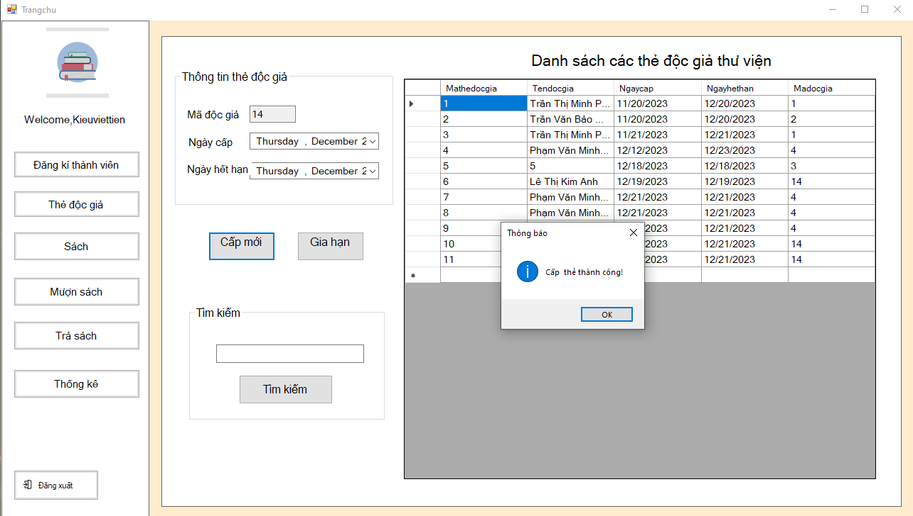
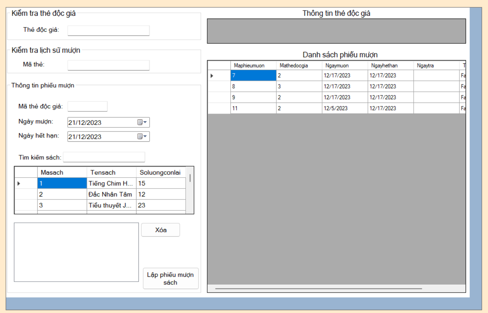

1.Tên dự án: Quản lý thư viện

2.Công nghệ sử dụng:
  - Ngôn ngữ: C#, winforms
  - Cơ sở dữ liệu: SQL server
  - IDE: Visual studio
    
3.Mục đích: Một ứng dụng giúp quản lý sách, độc giả, mượn/trả sách trong thư viện. 

4.Tính năng chính:
- Đăng nhập/Đăng xuất
- Quản lý sách
- Quản lý độc giả
- Quản lý nhân viên
- Quản lý tài khoản
- Thống kê, báo cáo
  
5.Giao diện
  - Đăng nhập:
     
  - Trang chủ:
     
  - Đăng kí thành viên:
     
  - Cấp thẻ độc giả:
     
  - Quản lý sách:
     
  - Quản lý mượn sách:
     
  - Quản lý trả sách:
     
  - Thống kê:
     
    
